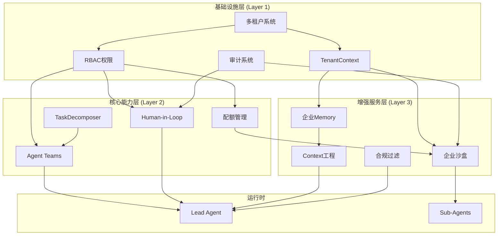
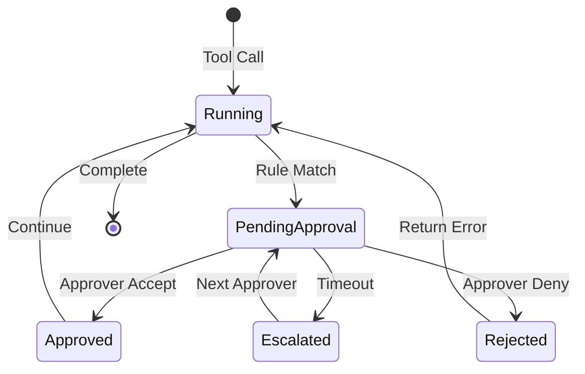

# DeerFlow 企业级架构设计规范

## 概述

本文档定义 DeerFlow 企业级版本的完整架构设计，涵盖6个核心企业级模块及其集成关系。该架构基于 DeerFlow 2.0 现有能力进行扩展，满足企业级部署的安全性、可审计性和可管理性要求。

### 目标读者

- 架构师：理解整体设计和模块关系
- 后端开发：实现具体模块
- 运维工程师：了解部署和隔离要求
- 安全审计：审查合规性

### 核心目标

1. **多租户支持**：单实例服务多企业，数据完全隔离
2. **细粒度权限**：RBAC 控制资源和操作访问
3. **可审计性**：所有关键操作可追溯、不可篡改
4. **人机协作**：关键决策点支持人工审批
5. **企业知识**：集成企业知识库，支持RAG
6. **合规保障**：内容过滤、品牌控制、敏感词检测

---

## 架构总览

### 分层架构

```
┌─────────────────────────────────────────────────────────────────┐
│                    企业级 DeerFlow 架构                          │
├─────────────────────────────────────────────────────────────────┤
│  增强服务层 (Layer 3)                                            │
│  ┌─────────────┬─────────────┬─────────────┬─────────────────┐  │
│  │ 企业Memory   │ 企业沙盒     │ Context工程  │ 合规与品牌       │  │
│  │ (知识库RAG)  │ (审计配额)   │ (知识注入)   │ (内容审查)       │  │
│  └─────────────┴─────────────┴─────────────┴─────────────────┘  │
├─────────────────────────────────────────────────────────────────┤
│  核心能力层 (Layer 2)                                            │
│  ┌─────────────┬─────────────┬─────────────┬─────────────────┐  │
│  │ Agent Teams  │ Human-in-Loop│ 配额管理     │ 任务编排         │  │
│  │ (多Agent协作)│ (审批工作流) │ (资源限制)   │ (动态调度)       │  │
│  └─────────────┴─────────────┴─────────────┴─────────────────┘  │
├─────────────────────────────────────────────────────────────────┤
│  基础设施层 (Layer 1)                                            │
│  ┌─────────────┬─────────────┬─────────────┬─────────────────┐  │
│  │ 多租户       │ RBAC         │ 审计日志     │ 租户上下文       │  │
│  │ (数据隔离)   │ (权限控制)   │ (不可篡改)   │ (线程存储)       │  │
│  └─────────────┴─────────────┴─────────────┴─────────────────┘  │
├─────────────────────────────────────────────────────────────────┤
│  运行时环境                                                      │
│  ┌─────────────────────────────────────────────────────────────┐│
│  │  Lead Agent → Sub-Agents → Tools → Skills → Sandboxes      ││
│  └─────────────────────────────────────────────────────────────┘│
├─────────────────────────────────────────────────────────────────┤
│  存储层                                                         │
│  ┌───────────┬───────────┬───────────┬───────────┬───────────┐  │
│  │ PostgreSQL│  Redis    │Vector Store│Object Store│Immutable │  │
│  │ (State)   │ (Cache)   │ (RAG)     │ (Files)    │Audit Log │  │
│  └───────────┴───────────┴───────────┴───────────┴───────────┘  │
└─────────────────────────────────────────────────────────────────┘
```

### 模块依赖关系



---

## 模块详细设计

### 模块 1: 多租户系统 (Multi-Tenancy)

**目标**: 单 DeerFlow 实例安全地服务多个企业租户

#### 核心组件

| 组件 | 职责 | 关键类/接口 |
|------|------|-------------|
| TenantContext | 线程级租户上下文存储 | `TenantContextVar` |
| TenantMiddleware | 请求级租户识别 | `TenantIdentificationMiddleware` |
| TenantResolver | 租户解析策略 | `DomainResolver`, `HeaderResolver` |
| NamespaceManager | 命名空间管理 | `TenantNamespace` |

#### 隔离策略

**严格模式 (Strict)**
- 独立数据库 Schema
- 独立向量集合
- 独立文件目录
- 独立 Redis DB

**宽松模式 (Relaxed)**
- 行级安全策略 (RLS)
- 集合内命名空间前缀
- 目录隔离
- Key 前缀隔离

#### 数据隔离矩阵

| 数据类型 | 严格模式 | 宽松模式 |
|----------|----------|----------|
| 应用状态 | Schema 隔离 | RLS |
| 向量数据 | 独立集合 | 命名空间过滤 |
| 文件系统 | `/tenants/{id}/` | 路径前缀 |
| 缓存 | DB 隔离 | Key 前缀 |
| 审计日志 | 独立表 | 分区表 |

#### API 设计

```python
# 获取当前租户
from deerflow.enterprise.tenancy import get_current_tenant

tenant = get_current_tenant()  # TenantContext 从线程存储读取
print(tenant.id)  # tenant_xxx
print(tenant.plan)  # enterprise
print(tenant.isolation_mode)  # strict/relaxed

# 在租户上下文中执行
async with tenant_context(tenant_id):
    # 所有操作自动限定在该租户命名空间
    result = await agent.run(task)
```

---

### 模块 2: RBAC 权限系统

**目标**: 细粒度控制用户、角色对资源的访问权限

#### 角色层级

```
TENANT_ADMIN        # 租户管理员：完整权限
├── PROJECT_MANAGER # 项目管理员：项目级管理
├── DEVELOPER       # 开发者：创建/编辑 Agents
├── OPERATOR        # 操作员：运行/监控
└── EXTERNAL        # 外部用户：受限访问
```

#### 权限模型

**资源类型**
- `agent` - Agent 定义和配置
- `thread` - 对话线程
- `sandbox` - 沙盒执行环境
- `skill` - 技能包
- `memory` - 记忆数据
- `audit_log` - 审计日志

**操作类型**
- `create`, `read`, `update`, `delete`
- `execute` - 执行 Agent
- `approve` - 审批权限
- `admin` - 管理权限

#### 策略引擎

```python
# Casbin 模型定义
[request_definition]
r = sub, dom, obj, act

[policy_definition]
p = sub, dom, obj, act

[role_definition]
g = _, _, _
g2 = _, _

[policy_effect]
e = some(where (p.eft == allow))

[matchers]
m = g(r.sub, p.sub, r.dom) && r.dom == p.dom && r.obj == p.obj && r.act == p.act
```

#### 权限检查中间件

```python
class RBACMiddleware(BaseMiddleware):
    """在请求入口点执行权限检查"""

    async def __call__(self, request):
        tenant = get_current_tenant()
        user = request.user

        # 检查资源访问权限
        if not await enforcer.enforce(
            user.id, tenant.id, request.resource, request.action
        ):
            raise PermissionDenied()

        return await self.next(request)
```

---

### 模块 3: Agent Teams

**目标**: 支持多 Agent 协作完成复杂任务

#### 核心概念

**Agent 类型注册表**
```python
@dataclass
class AgentType:
    name: str                    # 类型标识
    description: str             # 功能描述
    soul_template: str           # SOUL.md 模板路径
    capabilities: List[str]      # 能力标签
    allowed_tools: List[str]     # 允许的工具集
    max_tokens: int              # Token 限制
    model_preference: str        # 模型偏好
```

**TaskDecomposer**
```python
class TaskDecomposer:
    """LLM 驱动的任务分解器"""

    async def decompose(
        self,
        goal: str,
        context: TaskContext,
        available_agents: List[AgentType]
    ) -> ExecutionPlan:
        """
        将目标分解为可并行/串行的子任务计划

        Returns:
            ExecutionPlan: {
                "tasks": [SubTask],
                "dependencies": Graph,
                "parallel_groups": [[task_id]]
            }
        """
```

#### Agent Teams 编排引擎

```python
class AgentTeamOrchestrator:
    """多 Agent 协作编排器"""

    async def execute_plan(
        self,
        plan: ExecutionPlan,
        team: AgentTeam,
        context: ThreadState
    ) -> TeamExecutionResult:
        # 1. 按依赖图调度任务
        # 2. 并行执行无依赖任务
        # 3. 收集结果并聚合
        # 4. 处理失败和重试

    async def _execute_subtask(
        self,
        task: SubTask,
        agent: SubAgent,
        context: SubTaskContext
    ) -> SubTaskResult:
        # 在隔离上下文中执行子任务
        # 收集 Token 使用和执行时间
```

#### 集成点

- **输入**: TaskDecomposer 生成的执行计划
- **依赖**: RBAC (检查 Agent 使用权限)
- **依赖**: 配额系统 (检查并发 Agent 数)
- **输出**: 聚合结果注入主 Agent 上下文

---

### 模块 4: Human-in-Loop

**目标**: 关键决策点支持人工审批，支持长时间审批流程

#### 审批规则引擎

```python
@dataclass
class ApprovalRule:
    """审批规则定义"""
    name: str
    condition: Callable[[ToolCall], bool]
    approvers: List[str]  # 角色或用户ID列表
    timeout_hours: int
    escalation_chain: List[str]

# 预定义规则
FINANCIAL_APPROVAL = ApprovalRule(
    name="financial_transaction",
    condition=lambda tc: tc.tool == "transfer_funds" or tc.amount > 10000,
    approvers=["finance_manager", "cfo"],
    timeout_hours=24,
    escalation_chain=["cfo", "ceo"]
)

SENSITIVE_DATA_RULE = ApprovalRule(
    name="sensitive_data_access",
    condition=lambda tc: tc.tool in ["query_database", "export_data"],
    approvers=["data_owner"],
    timeout_hours=4,
    escalation_chain=["admin"]
)
```

#### 状态机设计



#### 审批中间件

```python
class ApprovalMiddleware(BaseMiddleware):
    """拦截需要审批的工具调用"""

    async def before_tool_call(self, state: ThreadState, tool_call: ToolCall):
        # 检查是否匹配审批规则
        rules = self.rule_engine.match(tool_call)

        if rules:
            # 创建审批请求
            approval = await self.create_approval_request(
                tool_call=tool_call,
                rules=rules,
                context=state
            )

            # 发送通知（飞书/钉钉/邮件）
            await self.notify_approvers(approval)

            # 挂起执行，等待审批
            raise ApprovalPending(approval.id)

    async def on_approval_received(self, approval_id: str, decision: ApprovalDecision):
        # 恢复挂起的执行
        await self.resume_execution(approval_id, decision)
```

#### 持久化与恢复

```python
class ApprovalStateManager:
    """管理审批状态的持久化"""

    async def suspend_execution(
        self,
        thread_id: str,
        checkpoint: ThreadCheckpoint,
        approval: ApprovalRequest
    ):
        # 保存完整状态到数据库
        await self.db.save({
            "thread_id": thread_id,
            "checkpoint": checkpoint,
            "approval": approval,
            "suspended_at": datetime.utcnow()
        })

    async def resume_execution(
        self,
        approval_id: str,
        decision: ApprovalDecision
    ) -> ThreadState:
        # 恢复状态并继续执行
        state = await self.db.load(approval_id)
        return await self.runtime.resume(state.checkpoint)
```

---

### 模块 5: 企业级沙盒

**目标**: 安全执行环境 + 完整审计 + 资源配额

#### 审计事件系统

**事件类型**
```python
class SandboxEventType(Enum):
    SANDBOX_ACQUIRED = "sandbox.acquired"
    SANDBOX_RELEASED = "sandbox.released"
    COMMAND_EXECUTED = "command.executed"
    FILE_READ = "file.read"
    FILE_WRITTEN = "file.written"
    NETWORK_REQUEST = "network.request"
    RESOURCE_LIMIT = "resource.limit_exceeded"
```

**事件结构**
```python
@dataclass
class AuditedEvent:
    event_id: str                    # UUID
    event_type: SandboxEventType
    tenant_id: str
    thread_id: str
    sandbox_id: str
    timestamp: datetime
    payload: Dict[str, Any]          # 事件详情
    signature: str                   # Ed25519 签名
    previous_hash: str               # 链式哈希

    def verify(self, public_key: str) -> bool:
        # 验证签名和链完整性
```

#### 审计日志存储

```python
class ImmutableAuditLog:
    """不可篡改的审计日志存储"""

    async def append(self, event: AuditedEvent):
        # 1. 计算前一个记录的哈希
        last_hash = await self.get_last_hash()
        event.previous_hash = last_hash

        # 2. 签名事件
        event.signature = self.sign(event)

        # 3. 写入只追加存储 (WORM)
        await self.storage.append(event)

        # 4. 发布实时通知
        await self.event_bus.publish("audit.event", event)
```

#### 配额管理

```python
@dataclass
class TenantQuota:
    """租户资源配额"""
    max_concurrent_sandboxes: int = 5
    max_cpu_cores: float = 4.0
    max_memory_gb: float = 8.0
    max_storage_gb: float = 100.0
    max_network_egress_mb: int = 1000
    command_timeout_seconds: int = 300

class QuotaEnforcementMiddleware(BaseMiddleware):
    """强制执行资源配额"""

    async def before_sandbox_acquired(self, tenant_id: str):
        quota = await self.get_quota(tenant_id)
        current = await self.get_usage(tenant_id)

        if current.concurrent >= quota.max_concurrent_sandboxes:
            raise QuotaExceeded("Concurrent sandbox limit reached")

    async def before_command_execute(self, sandbox: Sandbox, command: str):
        # 检查超时和资源限制
        quota = await self.get_quota(sandbox.tenant_id)

        if not self.check_timeout_quota(command, quota):
            raise QuotaExceeded("Command timeout quota exceeded")
```

#### 企业沙盒 Provider

```python
class EnterpriseSandboxProvider(SandboxProvider):
    """企业级沙盒，集成审计和配额"""

    def __init__(
        self,
        base_provider: SandboxProvider,
        audit_log: ImmutableAuditLog,
        quota_manager: QuotaManager
    ):
        self.base = base_provider
        self.audit = audit_log
        self.quota = quota_manager

    async def acquire(self, thread_id: str, tenant_id: str) -> Sandbox:
        # 检查配额
        await self.quota.check_before_acquire(tenant_id)

        # 获取沙盒
        sandbox = await self.base.acquire(thread_id, tenant_id)

        # 审计记录
        await self.audit.log(SandboxEventType.SANDBOX_ACQUIRED, {
            "sandbox_id": sandbox.id,
            "tenant_id": tenant_id,
            "thread_id": thread_id
        })

        # 包装为审计沙盒
        return AuditedSandbox(sandbox, self.audit)
```

---

### 模块 6: 企业级 Memory

**目标**: 集成企业知识库，支持项目级记忆，实现RAG增强

#### 架构设计

```
┌─────────────────────────────────────────────────────────────┐
│                     企业 Memory 架构                          │
├─────────────────────────────────────────────────────────────┤
│  知识源层                                                     │
│  ┌──────────┬──────────┬──────────┬──────────┐              │
│  │ Confluence│ Notion   │ SharePoint│ 内部Wiki │              │
│  └──────────┴──────────┴──────────┴──────────┘              │
├─────────────────────────────────────────────────────────────┤
│  连接器层 (KnowledgeConnector)                                │
│  ┌───────────────────────────────────────────────────────┐  │
│  │ 统一接口: sync(), search(), get_document()             │  │
│  └───────────────────────────────────────────────────────┘  │
├─────────────────────────────────────────────────────────────┤
│  处理管道层                                                   │
│  ┌──────────┬──────────┬──────────┬──────────┐              │
│  │ Crawler   │ Parser   │ Chunker   │ Embedder │              │
│  └──────────┴──────────┴──────────┴──────────┘              │
├─────────────────────────────────────────────────────────────┤
│  存储层                                                      │
│  ┌───────────────────────────────────────────────────────┐  │
│  │ Vector Store with Tenant Namespace Isolation           │  │
│  │ Collection: tenant_{id}                               │  │
│  └───────────────────────────────────────────────────────┘  │
├─────────────────────────────────────────────────────────────┤
│  检索层 (RAG)                                                │
│  ┌──────────┬──────────┬──────────┐                         │
│  │ Query    │ Hybrid   │ Re-rank  │                         │
│  │ Rewrite  │ Search   │ & Filter │                         │
│  └──────────┴──────────┴──────────┘                         │
├─────────────────────────────────────────────────────────────┤
│  注入层 (KnowledgeRetrievalMiddleware)                        │
└─────────────────────────────────────────────────────────────┘
```

#### CorporateKnowledgeBase 接口

```python
class KnowledgeConnector(Protocol):
    """企业知识库连接器协议"""

    async def sync(self, full: bool = False) -> SyncResult:
        """同步知识库内容"""

    async def search(
        self,
        query: str,
        filters: Optional[Dict] = None,
        top_k: int = 5
    ) -> List[KnowledgeChunk]:
        """搜索相关知识"""

    async def get_document(self, doc_id: str) -> Optional[Document]:
        """获取完整文档"""

class ConfluenceConnector(KnowledgeConnector):
    """Confluence 连接器实现"""

class NotionConnector(KnowledgeConnector):
    """Notion 连接器实现"""
```

#### 知识检索中间件

```python
class KnowledgeRetrievalMiddleware(BaseMiddleware):
    """在 LLM 调用前注入相关知识"""

    async def before_llm_call(self, state: ThreadState, messages: List[Message]):
        # 提取最后一条用户消息作为查询
        query = self.extract_query(messages)

        # 检索企业知识
        knowledge = await self.kb.search(
            query=query,
            filters={"tenant_id": state.tenant_id},
            top_k=5
        )

        # 格式化并注入上下文
        context = self.format_knowledge(knowledge)

        # 插入系统消息之前
        messages.insert(-1, Message.system(
            f"<enterprise_knowledge>\n{context}\n</enterprise_knowledge>"
        ))

        return messages
```

#### 项目级记忆

```python
class ProjectMemory:
    """项目级持久化记忆"""

    def __init__(self, project_id: str, tenant_id: str):
        self.namespace = f"tenant_{tenant_id}_project_{project_id}"

    async def save_milestone(self, milestone: Milestone):
        """保存项目里程碑"""

    async def get_context(self, query: str) -> ProjectContext:
        """获取项目相关上下文"""

    async def share_with_thread(self, thread_id: str):
        """将项目记忆共享到线程"""
```

---

### 模块 7: Context 工程

**目标**: 企业知识注入、品牌控制、合规过滤

#### 组件架构

```python
class ContextEngineeringPipeline:
    """Context 处理管道"""

    def __init__(self):
        self.stages = [
            EnterpriseKnowledgeStage(),      # 企业知识注入
            BrandControlStage(),              # 品牌规范控制
            ComplianceFilterStage(),          # 合规过滤
            SensitiveWordFilterStage(),       # 敏感词检测
        ]

    async def process(self, context: AgentContext) -> ProcessedContext:
        for stage in self.stages:
            context = await stage.transform(context)
        return context
```

#### 品牌控制

```python
class BrandController:
    """品牌规范控制器"""

    def __init__(self, brand_guidelines: BrandGuidelines):
        self.guidelines = brand_guidelines

    async def review_content(self, content: str) -> BrandReviewResult:
        """审查内容是否符合品牌规范"""

        issues = []

        # 检查禁用词汇
        for word in self.guidelines.forbidden_words:
            if word in content:
                issues.append(BrandIssue(
                    type="forbidden_word",
                    severity="high",
                    message=f"使用禁用词汇: {word}"
                ))

        # 检查视觉标准
        if self.has_visual_content(content):
            visual_check = await self.check_visual_standards(content)
            issues.extend(visual_check.issues)

        return BrandReviewResult(
            approved=len(issues) == 0,
            issues=issues
        )
```

#### 合规过滤

```python
class ComplianceFilter:
    """合规过滤器"""

    def __init__(
        self,
        sensitive_word_list: List[str],
        policy_rules: List[PolicyRule],
        auto_review: bool = True
    ):
        self.sensitive_words = sensitive_word_list
        self.policy_rules = policy_rules
        self.auto_review = auto_review

    async def filter_output(
        self,
        content: str,
        content_type: ContentType
    ) -> FilterResult:
        """过滤输出内容"""

        violations = []

        # 敏感词检测
        word_violations = self.check_sensitive_words(content)
        violations.extend(word_violations)

        # 策略规则检查
        for rule in self.policy_rules:
            if await rule.check(content, content_type):
                violations.append(Violation(
                    rule=rule.name,
                    severity=rule.severity
                ))

        # 自动审查（多模态）
        if self.auto_review and self.has_media(content):
            media_violations = await self.review_media(content)
            violations.extend(media_violations)

        return FilterResult(
            blocked=any(v.severity == "block" for v in violations),
            violations=violations,
            sanitized_content=self.sanitize(content) if violations else content
        )
```

---

## 实施计划

### 阶段划分

#### Phase 1: 基础设施层 (6周)

**目标**: 构建所有其他模块依赖的基础能力

| 切片 | 内容 | 交付物 | 依赖 |
|------|------|--------|------|
| 1.1 | TenantContext 线程存储 | `TenantMiddleware`, `get_current_tenant()` | - |
| 1.2 | 数据隔离边界 | Schema/RLS 实现，命名空间管理 | 1.1 |
| 1.3 | RBAC 角色模型 | Casbin 集成，策略定义 | 1.1 |
| 1.4 | 审计事件系统 | `AuditEvent`, `AuditLogger` | - |

#### Phase 2: 核心能力层 (8周)

**目标**: 实现 Agent 编排和审批工作流

| 切片 | 内容 | 交付物 | 依赖 |
|------|------|--------|------|
| 2.1 | TaskDecomposer | LLM 任务分解器 | 1.x |
| 2.2 | AgentRegistry | 自定义 Agent 注册 | 1.x |
| 2.3 | Agent Teams 编排 | 并行执行，结果聚合 | 2.1, 2.2 |
| 2.4 | ApprovalRuleEngine | 审批规则引擎 | 1.x |
| 2.5 | Human-in-Loop | 状态挂起/恢复 | 2.4 |
| 2.6 | 配额管理 | QuotaManager, QuotaMiddleware | 1.x |

#### Phase 3: 增强服务层 (8周)

**目标**: 企业级功能增强和合规能力

| 切片 | 内容 | 交付物 | 依赖 |
|------|------|--------|------|
| 3.1 | CorporateKnowledgeBase | 知识库连接器接口 | 1.x |
| 3.2 | KnowledgeRetrieval | RAG 中间件 | 3.1 |
| 3.3 | 沙盒审计增强 | 签名验证，不可篡改日志 | 1.4, 2.6 |
| 3.4 | 配额强制执行 | TenantQuotaMiddleware | 2.6 |
| 3.5 | BrandController | 品牌规范检查 | 1.x |
| 3.6 | ComplianceFilter | 合规过滤器 | 1.x |

#### Phase 4: 集成与优化 (4周)

**目标**: 全系统集成测试和性能优化

| 切片 | 内容 | 验收标准 |
|------|------|----------|
| 4.1 | 端到端集成测试 | 多租户 + Agent Teams + 审批流程 |
| 4.2 | 性能优化 | 配额缓存，审计批处理 |
| 4.3 | 安全审计 | 渗透测试，权限边界验证 |
| 4.4 | 文档与示例 | API 文档，企业部署指南 |

### 总时间线

```
Week:  1  2  3  4  5  6  7  8  9  10 11 12 13 14 15 16 17 18 19 20 21 22 23 24 25 26
       │<────── Phase 1 ──────>│<────────── Phase 2 ──────────>│<────────── Phase 3 ──────────>│<── Phase 4 ──>│
       │                        │                                │                               │              │
Slice:  1.1 1.2 1.3 1.4        2.1 2.2 2.3 2.4 2.5 2.6          3.1 3.2 3.3 3.4 3.5 3.6         4.1 4.2 4.3 4.4
```

---

## 技术选型

### 核心依赖

| 模块 | 技术选型 | 理由 |
|------|----------|------|
| RBAC | Casbin / Oso | 成熟的策略引擎，支持 ABAC |
| 审计存储 | PostgreSQL WORM / Immutable Log | 事务支持，时间旅行查询 |
| 向量存储 | Milvus / Weaviate / PGVector | 命名空间支持，混合检索 |
| 缓存 | Redis Cluster | 分布式计数器，会话存储 |
| 消息队列 | Redis Streams / RabbitMQ | 审批通知，事件总线 |
| 签名 | Ed25519 | 高性能，短签名 |

### 中间件顺序

```python
# 企业级中间件链（按执行顺序）
MIDDLEWARE_CHAIN = [
    # Layer 1: 基础设施
    TenantIdentificationMiddleware,    # 租户识别
    AuthenticationMiddleware,          # 身份认证
    RBACMiddleware,                    # 权限检查

    # Layer 2: 核心能力
    QuotaCheckMiddleware,              # 配额检查
    ApprovalMiddleware,                # 审批拦截
    AgentTeamOrchestratorMiddleware,   # Agent Teams

    # Layer 3: 增强服务
    KnowledgeRetrievalMiddleware,      # 知识检索
    ContextEngineeringMiddleware,      # Context 工程
    AuditedSandboxMiddleware,          # 审计沙盒
    ComplianceCheckMiddleware,         # 合规检查

    # 标准 DeerFlow 中间件
    ThreadDataMiddleware,
    UploadsMiddleware,
    # ... 其他标准中间件
]
```

---

## 风险评估与缓解

### 风险矩阵

| 风险 | 概率 | 影响 | 缓解策略 |
|------|------|------|----------|
| 多租户数据泄露 | 低 | 极高 | 自动化集成测试覆盖边界；定期安全审计 |
| HIL 状态丢失 | 中 | 高 | 持久化状态机；消息队列确保投递；死信队列 |
| Agent Teams 无限递归 | 中 | 高 | 层级限制；Token 预算；循环检测中间件 |
| 配额绕过 | 低 | 高 | 所有入口检查；分布式计数器；硬限制优先 |
| 审计日志篡改 | 低 | 极高 | 链式哈希；签名验证；只追加存储 |
| 知识库RAG延迟 | 中 | 中 | 缓存策略；预计算；异步更新 |

---

## 验收标准

### Phase 1 验收

- [ ] 多租户切换不影响现有功能（回归测试通过）
- [ ] RBAC 能阻止所有越权访问（安全测试通过）
- [ ] 审计日志100%关键事件覆盖
- [ ] 单测覆盖率 > 80%
- [ ] 性能：租户切换开销 < 5ms

### Phase 2 验收

- [ ] Agent Teams 完成10步以上多步任务
- [ ] HIL 支持72小时以上审批流程
- [ ] 配额超限被正确拦截（100%拦截率）
- [ ] 集成测试通过率 100%
- [ ] 并发 Agent 执行稳定

### Phase 3-4 验收

- [ ] 企业知识库RAG准确率 > 85%
- [ ] 沙盒审计日志不可篡改（签名验证100%通过）
- [ ] 合规过滤检出率 > 95%，误报率 < 5%
- [ ] 压力测试通过：并发100+租户，响应时间 < 2s
- [ ] 安全审计无高危漏洞

---

## 附录

### A. 术语表

| 术语 | 定义 |
|------|------|
| Tenant | 租户，代表一个企业或组织 |
| RBAC | 基于角色的访问控制 |
| HIL | Human-in-Loop，人机协作 |
| RAG | 检索增强生成 |
| SOUL.md | Agent 灵魂定义文件 |
| TaskDecomposer | 任务分解器 |
| WORM | Write Once Read Many，只追加存储 |

### B. 参考资料

- [Casbin 文档](https://casbin.org/)
- [LangGraph 多智能体](https://langchain-ai.github.io/langgraph/concepts/multi_agent/)
- [向量数据库对比](https://thedataquarry.com/posts/vector-db-1/)
- [企业级 RAG 最佳实践](https://www.pinecone.io/learn/enterprise-rag/)

### C. 变更记录

| 版本 | 日期 | 变更 | 作者 |
|------|------|------|------|
| 1.0.0 | 2026-05-22 | 初始版本 | Claude Code |
| 2.0.0 | 2026-05-22 | 完整架构设计，6模块集成 | Claude Code |

---

*本文档使用 [Claude Code](https://claude.ai/code) 生成，遵循 DeerFlow 企业级设计规范。*
